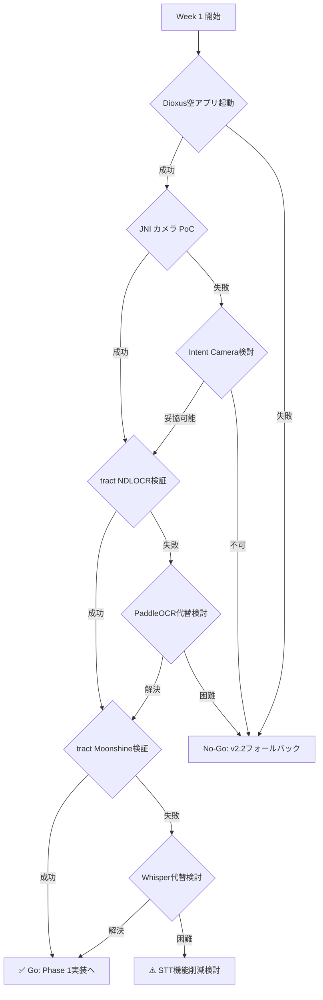

# Shusei MVP 実装計画書

**作成日**: 2026-03-06  
**仕様バージョン**: v2.3  
**ステータス**: 📋 実装計画

---

## 1. プロジェクト概要

### 1.1 目標

Pure Rust + Dioxus による完全オフライン読書アプリのMVP開発。12週間で以下を実現：

- 紙の本 → カメラ撮影 → OCR → 付箋ノート
- PDF → OCR → リフロー読書
- ボイスメモ → STT → 文字起こし
- 単語採集機能

### 1.2 技術スタック

| レイヤー | 技術 |
|---------|------|
| UIフレームワーク | Dioxus 0.7 |
| 推論ランタイム | tract-onnx 0.21 |
| OCRモデル | NDLOCR-Lite ONNX |
| STTモデル | Moonshine Tiny ONNX |
| データベース | SQLite (rusqlite) |
| 形態素解析 | lindera 0.34 |
| PDF処理 | pdfium-render 0.8 |

### 1.3 コード構成

```
shusei/
├── Dioxus.toml              # Dioxusプロジェクト設定
├── Cargo.toml
├── src/
│   ├── main.rs              # エントリーポイント
│   ├── app.rs               # ルートコンポーネント + ルーティング
│   ├── ui/                  # Dioxusコンポーネント
│   │   ├── camera.rs        # カメラ撮影画面
│   │   ├── notes.rs         # 付箋一覧・検索
│   │   ├── reader.rs        # リフロー読書ビューア
│   │   ├── vocab.rs         # 単語リスト
│   │   └── components/      # 共通UIコンポーネント
│   ├── core/                # ビジネスロジック（プラットフォーム非依存）
│   │   ├── ocr/             # OCRパイプライン
│   │   ├── stt/             # STTパイプライン
│   │   ├── db.rs            # SQLite CRUD + FTS
│   │   ├── vocab.rs         # 単語抽出・形態素解析
│   │   └── pdf.rs           # PDF処理
│   └── platform/            # プラットフォーム固有コード
│       ├── mod.rs           # PlatformApi trait
│       ├── android.rs       # JNI経由カメラ・マイク
│       ├── ios.rs           # ObjC経由（将来）
│       └── desktop.rs       # ファイルダイアログ等（将来）
├── assets/                   # モデルファイル、アイコン等
│   └── models/
│       ├── ndlocr/
│       └── moonshine/
└── platform/                 # プラットフォーム固有設定
    └── android/
        └── AndroidManifest.xml
```

---

## 2. 事前準備チェックリスト

### 2.1 開発環境

- [ ] Rust toolchain インストール (stable + nightly for Dioxus)
- [ ] Android SDK インストール
- [ ] Android NDK インストール
- [ ] Dioxus CLI インストール (`cargo install dioxus-cli`)
- [ ] Moto G66j 5G 実機（開発者モード有効化）
- [ ] USB デバッグ有効化

### 2.2 モデルファイル

- [ ] NDLOCR-Lite ONNX モデル取得
  - text_detection.onnx
  - text_recognition.onnx
  - direction_classifier.onnx
- [ ] Moonshine Tiny ONNX モデル取得
  - moonshine-tiny-en-encoder.onnx
  - moonshine-tiny-en-decoder.onnx
  - moonshine-tiny-ja-encoder.onnx
  - moonshine-tiny-ja-decoder.onnx
- [ ] モデルファイルのライセンス確認（CC BY 4.0, MIT, Moonshine Community License）

### 2.3 リスク評価

| リスク | 確率 | 影響 | 検証方法 |
|-------|------|------|---------|
| Dioxus Mobile不安定 | 中 | 高 | Week 1で空アプリ起動確認 |
| tract NDLOCR非互換 | 中 | 高 | Week 1でONNX推論テスト |
| tract Moonshine非互換 | 低-中 | 中 | Week 1でONNX推論テスト |
| JNI カメラ複雑性 | 中 | 中 | Week 1でPoC実装 |

---

## 3. Week 1-2: 基盤構築 + 技術検証

### 3.1 目標

**🚩 マイルストーン**: Moto G66j上でDioxusアプリ + tractによるONNX推論が動く

### 3.2 タスク詳細

#### 3.2.1 プロジェクト初期化

```
[ ] cargo install dioxus-cli
[ ] dx new shusei --template mobile
[ ] Cargo.toml 依存関係追加
[ ] Dioxus.toml 設定
[ ] AndroidManifest.xml 設定（カメラ・マイク権限）
```

#### 3.2.2 Dioxus Android 検証（基本）

```
[ ] dx serve --platform android でビルド
[ ] Moto G66j で空アプリ起動確認
[ ] WebViewレンダラーの挙動確認
```

#### 3.2.3 【最重要】Dioxus + JNI カメラ PoC

> **⚠️ この検証が失敗した場合、UI実装方法全体（Dioxus vs Tauri + Leptos）を再考する必要があります**

**目標**: DioxusアプリからJNI経由でAndroid Camera2 APIを呼び出し、画像データを取得できることを確認

**実装ステップ**:

```
[ ] 1. jni crate 依存関係追加
[ ] 2. AndroidManifest.xml にカメラ権限追加
    <uses-permission android:name="android.permission.CAMERA" />
    <uses-feature android:name="android.hardware.camera" />
[ ] 3. JNI から Android Context 取得
[ ] 4. Camera2 API でプレビュー開始
[ ] 5. 画像フレーム取得 (ImageReader)
[ ] 6. NV21/YUV → RGB 変換
[ ] 7. Dioxus UI でプレビュー表示
[ ] 8. 撮影トリガー → 画像データ取得
[ ] 9. 取得した画像をDioxusコンポーネントで表示
```

**検証項目**:

| 項目 | 成功基準 | 失敗時の対応 |
|-----|---------|------------|
| JNI初期化 | JNIEnv取得成功 | Dioxus JNI対応の制限調査 |
| Camera2 API呼び出し | プレビュー開始 | Intent-based fallback検討 |
| 画像データ取得 | RGB配列取得成功 | データ変換方法の再検討 |
| Dioxus連携 | 画像表示成功 | **UI実装方法の再考** |

**代替案（フォールバック）**:

1. **Intent-based Camera**: Android標準カメラアプリを起動し、結果を受け取る
   - メリット: 実装が簡単
   - デメリット: ユーザー体験が劣る（アプリ切り替え）

2. **Tauri v2 + Leptos**: v2.2仕様にフォールバック
   - core/ 層は再利用可能
   - Tauri Pluginでのカメラ実装

3. **React Native / Flutter**: クロスプラットフォーム見直し
   - Rust coreはFFI経由で利用

**判定基準**:

```
✅ Go: JNI経由でカメラ画像取得 + Dioxus表示が動作
⚠️ Conditional Go: Intent-based camera で妥協可能か検討
❌ No-Go: Tauri v2 + Leptos (v2.2) にフォールバック
```

#### 3.2.4 tract クロスコンパイル検証

```
[ ] Android ターゲット追加 (aarch64-linux-android)
[ ] tract-onnx 依存関係追加
[ ] サンプルONNXモデルで推論テスト
[ ] メモリ使用量確認
```

#### 3.2.4 NDLOCR-Lite tract 互換性検証

```
[ ] NDLOCR-Lite ONNX モデルロード
[ ] text_recognition 単体推論テスト
[ ] text_detection 推論テスト
[ ] direction_classifier 推論テスト
[ ] 非対応opの特定（あれば）
```

#### 3.2.5 Moonshine tract 互換性検証

```
[ ] Moonshine encoder ONNX ロード
[ ] Moonshine decoder ONNX ロード
[ ] サンプル音声で推論テスト
[ ] 非対応opの特定（あれば）
```

#### 3.2.6 JNI カメラアクセス PoC

```
[ ] jni crate 依存関係追加
[ ] Android Camera2 API 呼び出し実装
[ ] 画像データ取得確認
[ ] Dioxusからの呼び出し確認
```

### 3.3 Go/No-Go 判定基準

> **優先順位**: JNI カメラ > tract NDLOCR > tract Moonshine > Dioxus基本動作

| 優先度 | 条件 | Go条件 | No-Go対応 |
|-------|-----|-------|----------|
| **P0** | **JNI カメラ** | **画像取得 + Dioxus表示が動作** | **UI実装方法全体を再考（v2.2フォールバック）** |
| P1 | tract NDLOCR | 全モデルがロード・推論可能 | onnx-simplifier → PaddleOCR代替検討 |
| P2 | tract Moonshine | encoder/decoderがロード可能 | Whisper Tiny ONNX にフォールバック |
| P3 | Dioxus Android | 空アプリが起動しWebViewが動作 | Tauri v2 + Leptos (v2.2) にフォールバック |

**判定フロー**:



---

## 4. Week 3-5: OCRパイプライン実装

### 4.1 目標

**🚩 マイルストーン**: Rust CLIで画像 → Markdown変換

### 4.2 タスク詳細

#### 4.2.1 core/ocr エンジン trait 定義

```rust
// core/ocr/engine.rs
pub trait OcrEngine: Send + Sync {
    async fn process_image(&self, image: &[u8]) -> Result<OcrResult, OcrError>;
}

pub struct OcrResult {
    pub markdown: String,
    pub plain_text: String,
    pub regions: Vec<TextRegion>,
    pub confidence: f32,
}
```

#### 4.2.2 画像前処理パイプライン

```
[ ] 画像読み込み (image crate)
[ ] リサイズ (長辺1024px以下)
[ ] グレースケール変換
[ ] 正規化 (0-1 float32)
[ ] テンソル変換
```

#### 4.2.3 text_recognition モデル統合

```
[ ] ONNXモデルロード
[ ] 入力テンソル準備
[ ] 推論実行
[ ] 出力デコード (CTC decode)
[ ] 文字認識精度テスト
```

#### 4.2.4 text_detection + 後処理

```
[ ] text_detection ONNX ロード
[ ] テキスト領域検出
[ ] Post-processing (NMS, box refinement)
[ ] 領域切り出し
```

#### 4.2.5 direction_classifier + 読み順ソート

```
[ ] direction_classifier ONNX ロード
[ ] テキスト方向分類 (0°/90°/180°/270°)
[ ] 縦書き/横書き判定
[ ] 読み順ソートアルゴリズム実装
```

#### 4.2.6 Markdown生成パイプライン

```
[ ] テキスト領域統合
[ ] Markdownフォーマット生成
[ ] 段落構造推定
[ ] プレーンテキスト抽出 (FTS用)
```

### 4.3 検証項目

- [ ] 日本語テキスト認識精度確認
- [ ] 縦書きテキスト処理確認
- [ ] 処理時間測定 (目標: 5-15秒/ページ)
- [ ] メモリ使用量測定 (目標: ~500MB ピーク)

---

## 5. Week 5-6: カメラ統合 + Phase 1 完成

### 5.1 目標

**🚩 マイルストーン**: 紙の本撮影 → OCR → 付箋保存 → 検索

### 5.2 タスク詳細

#### 5.2.1 platform/android JNIカメラ実装

```
[ ] PlatformApi trait 定義
[ ] JNI環境初期化
[ ] Camera2 API 呼び出し
[ ] 画像データ変換 (NV21 → RGB)
[ ] プレビュー表示
[ ] 撮影トリガー
```

#### 5.2.2 SQLite スキーマ実装

```sql
-- core/db/schema.sql
CREATE TABLE sticky_notes (
    id          INTEGER PRIMARY KEY AUTOINCREMENT,
    created_at  TEXT NOT NULL DEFAULT (datetime('now')),
    updated_at  TEXT NOT NULL DEFAULT (datetime('now')),
    image_path       TEXT,
    ocr_markdown     TEXT,
    voice_transcript TEXT,
    book_title   TEXT,
    page_number  INTEGER,
    user_memo    TEXT,
    tags         TEXT,
    ocr_text_plain TEXT
);

CREATE VIRTUAL TABLE sticky_notes_fts USING fts5(
    ocr_text_plain, user_memo, book_title, voice_transcript,
    content='sticky_notes', content_rowid='id'
);

-- インデックス追加
CREATE INDEX idx_sticky_notes_book ON sticky_notes(book_title);
CREATE INDEX idx_sticky_notes_created ON sticky_notes(created_at DESC);
```

#### 5.2.3 付箋CRUD実装

```
[ ] core/db.rs 実装
[ ] CREATE: 新規付箋作成
[ ] READ: 付箋取得 (ID, 一覧, 検索)
[ ] UPDATE: 付箋更新
[ ] DELETE: 付箋削除
[ ] FTS5 全文検索実装
```

#### 5.2.4 付箋一覧UI (Dioxus)

```
[ ] ui/notes.rs コンポーネント
[ ] 付箋一覧表示
[ ] 書籍別グルーピング
[ ] 検索UI
[ ] サムネイル表示
[ ] OCR結果プレビュー
```

---

## 6. Week 7-8: PDF リフロー読書 + Phase 2

### 6.1 目標

**🚩 マイルストーン**: PDF → 変換 → リフロー読書

### 6.2 タスク詳細

#### 6.2.1 pdfium-render PDF画像化

```
[ ] pdfium-render 依存関係追加
[ ] PDFページ画像化
[ ] ページ番号管理
[ ] 進捗コールバック
```

#### 6.2.2 OCR バッチ適用

```
[ ] バックグラウンド処理実装
[ ] 進捗バーUI
[ ] キャンセル機能
[ ] エラーハンドリング
```

#### 6.2.3 books/book_pages スキーマ

```sql
CREATE TABLE books (
    id              INTEGER PRIMARY KEY AUTOINCREMENT,
    title           TEXT NOT NULL,
    file_path       TEXT,
    total_pages     INTEGER,
    converted_pages INTEGER DEFAULT 0,
    last_read_pos   REAL DEFAULT 0.0,
    created_at      TEXT NOT NULL DEFAULT (datetime('now')),
    updated_at      TEXT NOT NULL DEFAULT (datetime('now'))
);

CREATE TABLE book_pages (
    id          INTEGER PRIMARY KEY AUTOINCREMENT,
    book_id     INTEGER NOT NULL REFERENCES books(id),
    page_number INTEGER NOT NULL,
    markdown    TEXT NOT NULL,
    confidence  REAL,
    UNIQUE(book_id, page_number)
);

CREATE INDEX idx_books_updated ON books(updated_at DESC);
```

#### 6.2.4 リフロービューアUI

```
[ ] ui/reader.rs コンポーネント
[ ] pulldown-cmark で Markdown → HTML
[ ] フォントサイズ調整
[ ] 行間調整
[ ] テーマ切り替え (ライト/ダーク)
[ ] 読書位置記憶
```

---

## 7. Week 9-10: STT統合 + Phase 3

### 7.1 目標

**🚩 マイルストーン**: ボイスメモ → 自動文字起こし → 付箋統合

### 7.2 タスク詳細

#### 7.2.1 Moonshine encoder統合

```
[ ] core/stt/engine.rs trait 定義
[ ] encoder ONNX ロード
[ ] 音声前処理 (16kHz mono PCM)
[ ] メルスペクトログラム生成
[ ] encoder 推論
```

#### 7.2.2 Decoder自己回帰ループ

```
[ ] decoder ONNX ロード
[ ] KVキャッシュ管理実装
[ ] 自己回帰ループ実装
[ ] EOS トークン検出
[ ] 最大長制限
```

#### 7.2.3 トークナイザー実装

```
[ ] tokenizers crate 統合
[ ] Moonshine tokenizer ロード
[ ] トークン → テキスト変換
[ ] 日英モデル切り替え
```

#### 7.2.4 JNI AudioRecord統合

```
[ ] platform/android.rs に録音機能追加
[ ] AudioRecord API 呼び出し
[ ] 16kHz mono PCM 変換
[ ] 最大30秒制限
[ ] 録音UI
```

---

## 8. Week 11-12: 単語採集 + 仕上げ

### 8.1 目標

**🚩 マイルストーン**: 完全なMVP実機動作

### 8.2 タスク詳細

#### 8.2.1 lindera 形態素解析統合

```
[ ] lindera 依存関係追加
[ ] IPAdic 辞書設定
[ ] 分かち書き実装
[ ] 品詞フィルタリング
```

#### 8.2.2 タップ検出 + 単語抽出

```
[ ] ui/reader.rs にタップイベント追加
[ ] タップ位置 → 単語特定
[ ] 英語: スペース区切り
[ ] 日本語: lindera 形態素解析
[ ] 用例文抽出
```

#### 8.2.3 vocabulary スキーマ

```sql
CREATE TABLE vocabulary (
    id               INTEGER PRIMARY KEY AUTOINCREMENT,
    word             TEXT NOT NULL,
    meaning          TEXT,
    example_sentence TEXT,
    source_book      TEXT,
    source_page      INTEGER,
    tags             TEXT,
    created_at       TEXT NOT NULL DEFAULT (datetime('now')),
    review_count     INTEGER DEFAULT 0,
    last_reviewed_at TEXT
);

CREATE INDEX idx_vocab_word ON vocabulary(word);
```

#### 8.2.4 単語リスト機能

```
[ ] ui/vocab.rs コンポーネント
[ ] 単語一覧表示
[ ] 検索機能
[ ] Markdown/CSV エクスポート
```

#### 8.2.5 仕上げ

```
[ ] UIブラッシュアップ
[ ] エラーハンドリング改善
[ ] パフォーマンス最適化
[ ] dx bundle リリースビルド
[ ] Moto G66j 実機テスト
```

---

## 9. エラー処理戦略

### 9.1 エラー型定義

```rust
// core/error.rs
use thiserror::Error;

#[derive(Error, Debug)]
pub enum ShuseiError {
    #[error("OCR error: {0}")]
    Ocr(#[from] OcrError),
    
    #[error("STT error: {0}")]
    Stt(#[from] SttError),
    
    #[error("Database error: {0}")]
    Database(#[from] rusqlite::Error),
    
    #[error("IO error: {0}")]
    Io(#[from] std::io::Error),
    
    #[error("Platform error: {0}")]
    Platform(String),
    
    #[error("Model not found: {0}")]
    ModelNotFound(String),
}

#[derive(Error, Debug)]
pub enum OcrError {
    #[error("Image preprocessing failed: {0}")]
    Preprocessing(String),
    
    #[error("Model inference failed: {0}")]
    Inference(String),
    
    #[error("Text detection failed")]
    DetectionFailed,
    
    #[error("Text recognition failed")]
    RecognitionFailed,
}

#[derive(Error, Debug)]
pub enum SttError {
    #[error("Audio preprocessing failed: {0}")]
    Preprocessing(String),
    
    #[error("Encoder inference failed: {0}")]
    Encoder(String),
    
    #[error("Decoder inference failed: {0}")]
    Decoder(String),
    
    #[error("Tokenization failed: {0}")]
    Tokenization(String),
}
```

### 9.2 エラー伝播

- `core/` 層: `Result<T, ShuseiError>` を返す
- `ui/` 層: エラーをユーザーに表示（トースト/ダイアログ）
- `platform/` 層: プラットフォーム固有エラーを `ShuseiError::Platform` に変換

---

## 10. テスト戦略

### 10.1 ユニットテスト

```
[ ] core/ocr 前処理テスト
[ ] core/ocr 後処理テスト
[ ] core/stt トークナイザーテスト
[ ] core/db CRUDテスト
[ ] core/vocab 形態素解析テスト
```

### 10.2 統合テスト

```
[ ] OCR E2Eテスト (画像 → Markdown)
[ ] STT E2Eテスト (音声 → テキスト)
[ ] DB + FTS テスト
[ ] PDF処理テスト
```

### 10.3 テストデータ

- 日本語テキスト画像サンプル (縦書き/横書き)
- 英語テキスト画像サンプル
- 日本語音声サンプル (16kHz mono)
- 英語音声サンプル (16kHz mono)
- サンプルPDF

---

## 11. CI/CD パイプライン

### 11.1 GitHub Actions

```yaml
# .github/workflows/ci.yml
name: CI

on:
  push:
    branches: [main, develop]
  pull_request:
    branches: [main]

jobs:
  test:
    runs-on: ubuntu-latest
    steps:
      - uses: actions/checkout@v4
      - uses: dtolnay/rust-toolchain@stable
      - run: cargo test --all-features
  
  lint:
    runs-on: ubuntu-latest
    steps:
      - uses: actions/checkout@v4
      - uses: dtolnay/rust-toolchain@stable
      - run: cargo clippy -- -D warnings
      - run: cargo fmt --check
  
  android-build:
    runs-on: ubuntu-latest
    needs: [test, lint]
    steps:
      - uses: actions/checkout@v4
      - uses: dtolnay/rust-toolchain@stable
        with:
          targets: aarch64-linux-android
      - run: cargo install dioxus-cli
      - run: dx build --platform android --release
```

---

## 12. モデル管理戦略

### 12.1 初回ダウンロード

```
[ ] アプリ初回起動時にモデル存在確認
[ ] モデルがない場合、ダウンロードUI表示
[ ] 進捗表示
[ ] チェックサム検証
[ ] モデル保存先: assets/models/
```

### 12.2 モデル遅延ロード

```rust
// core/model_manager.rs
pub struct ModelManager {
    ocr_engine: Option<Arc<OcrEngine>>,
    stt_engine: Option<Arc<SttEngine>>,
}

impl ModelManager {
    pub async fn get_ocr_engine(&mut self) -> Result<Arc<OcrEngine>, ShuseiError> {
        if self.ocr_engine.is_none() {
            self.ocr_engine = Some(Arc::new(OcrEngine::load().await?));
        }
        Ok(self.ocr_engine.as_ref().unwrap().clone())
    }
    
    pub fn unload_ocr_engine(&mut self) {
        self.ocr_engine = None;
        // メモリ解放
    }
}
```

---

## 13. フォールバック戦略

### 13.1 Dioxus → Tauri + Leptos

`core/` 層は完全に再利用可能:

```
core/ (OCR, STT, DB, 単語処理)
  ↑ そのまま再利用
  │
  ├── Dioxus UI が安定 → Dioxus で続行
  └── Dioxus が不安定 → Tauri + Leptos UI に差し替え
```

### 13.2 tract → 代替モデル

| モデル | 代替 | 条件 |
|-------|------|------|
| NDLOCR-Lite | PaddleOCR | tract非対応op検出時 |
| Moonshine | Whisper Tiny ONNX | tract非対応op検出時 |

### 13.3 JNI カメラ → Intent

JNI経由が複雑な場合、Android Intent経由でカメラアプリを起動し、結果を受け取る方式にフォールバック。

---

## 14. 成功基準

### 14.1 Week 1-2 (基盤構築)

- [ ] Dioxus空アプリがMoto G66jで起動
- [ ] tractでNDLOCR-Lite推論成功
- [ ] tractでMoonshine推論成功
- [ ] JNIでカメラ画像取得成功

### 14.2 Week 5-6 (Phase 1)

- [ ] 紙の本撮影 → OCR → 付箋保存がE2Eで動作
- [ ] 付箋検索が動作
- [ ] 処理時間: 5-15秒/ページ

### 14.3 Week 7-8 (Phase 2)

- [ ] PDF → OCR → リフロー読書が動作
- [ ] 読書位置が記憶される

### 14.4 Week 9-10 (Phase 3)

- [ ] ボイスメモ → 文字起こしが動作
- [ ] 処理時間: 30秒音声 → 3-8秒

### 14.5 Week 11-12 (Phase 4)

- [ ] 単語採集が動作
- [ ] 全機能が実機で動作
- [ ] メモリ使用量: アイドル ~100MB, OCR ~500MB, STT ~200MB

---

## 15. 参考資料

- [Dioxus 0.7 Documentation](https://dioxuslabs.com/)
- [tract ONNX Runtime](https://github.com/sonos/tract)
- [NDLOCR-Lite](https://github.com/ndl-lab/ndlocr)
- [Moonshine ASR](https://github.com/usefulsensors/moonshine)
- [lindera](https://github.com/lindera-morphology/lindera)
- [pdfium-render](https://github.com/ajrcarey/pdfium-render)

---

*計画作成日: 2026-03-06*